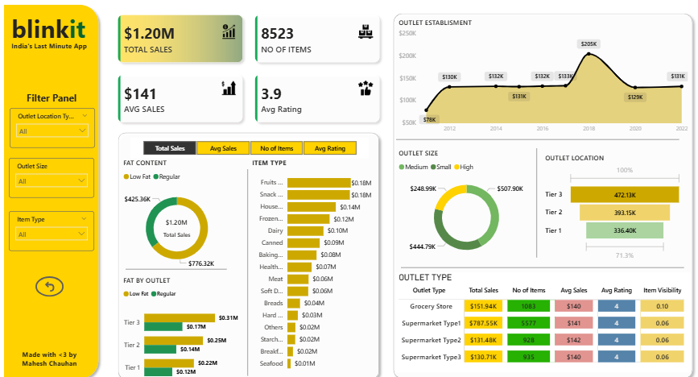

# 🛒 Blinkit Sales Analytics Dashboard

An interactive Business Intelligence dashboard built to analyze retail sales data across outlets, product categories, and customer behavior. This project transforms raw data into actionable insights using visual analytics.

---

## 📊 Project Overview

The Blinkit Dashboard provides a comprehensive view of sales performance, item distribution, and outlet-level insights. It helps stakeholders understand key business metrics and identify high-performing segments.

---

## 🚀 Key Features

- 📈 **KPI Metrics**
  - Total Sales: $1.20M
  - Average Sales: $141
  - Number of Items: 8523
  - Average Rating: 3.9

- 🎛️ **Interactive Filters**
  - Outlet Location Type
  - Outlet Size
  - Item Type

- 📉 **Visualizations**
  - Sales trend over years
  - Sales distribution by item type
  - Outlet-wise performance (Tier 1, 2, 3)
  - Fat content analysis (Low Fat vs Regular)
  - Outlet size distribution
  - Category-level sales breakdown

- 🧠 **Insights Delivered**
  - Identification of top-performing product categories
  - Revenue contribution by outlet tiers
  - Customer preference patterns
  - Sales trends and growth opportunities

---

## 🛠️ Tech Stack

- **Power BI** (or Tableau / Excel — update as per your tool)
- Data Cleaning & Transformation
- DAX (for calculated measures, if used)

---

## 📂 Dataset

- Retail sales dataset containing:
  - Item details
  - Outlet information
  - Sales metrics
  - Customer ratings

*(Dataset can be public or synthetic for analysis purposes)*

---

## 📌 Dashboard Highlights

- Clean and modern UI design
- KPI cards for quick insights
- Dynamic filtering for real-time analysis
- Business-focused visual storytelling

---

## 📸 Dashboard Preview

---

## 💡 Key Learnings

- Building interactive dashboards for business use-cases  
- Data visualization best practices  
- Designing user-friendly analytics interfaces  
- Extracting actionable insights from raw data  

---

## 🔗 Future Improvements

- Add real-time data integration  
- Deploy dashboard on cloud (Power BI Service)  
- Include predictive analytics for sales forecasting  

---

## 👨‍💻 Author

**Mahesh Chauhan**  
B.Tech AI & Data Science  

---

## ⭐ If you like this project

Give it a star ⭐ on GitHub!
